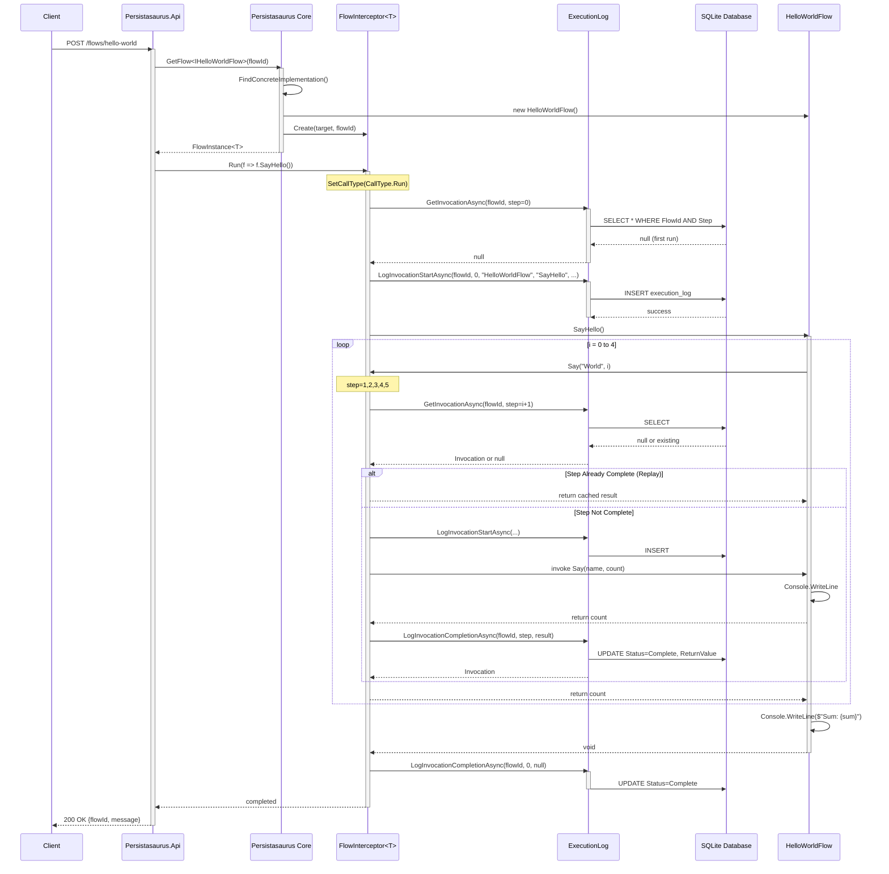
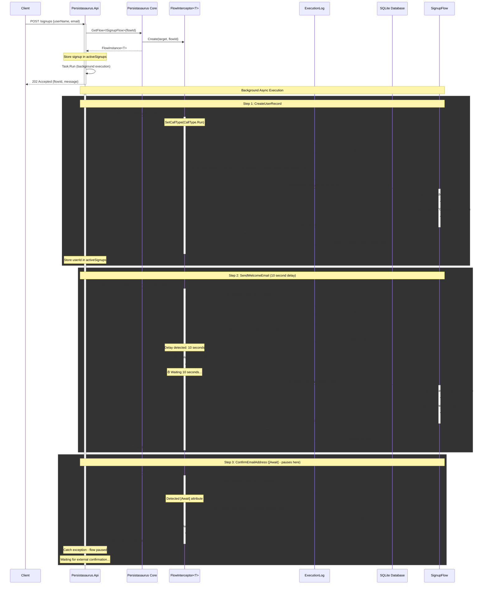
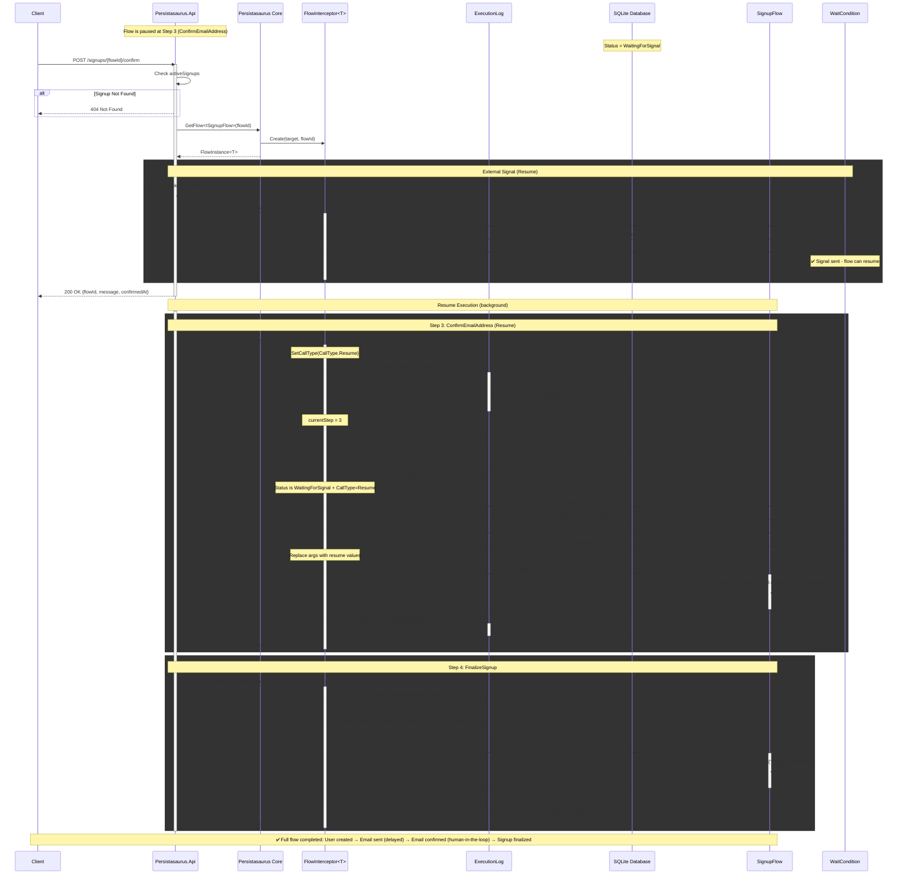

# Workflows

##  HELLO WORLD FLOW EXAMPLE

```mermaid
sequenceDiagram
    participant Client
    participant API as Persistasaurus.Api
    participant Core as Persistasaurus Core
    participant Proxy as FlowInterceptor<T>
    participant ExecLog as ExecutionLog
    participant DB as SQLite Database
    participant Impl as HelloWorldFlow

    Client->>API: POST /flows/hello-world
    activate API
    
    API->>Core: GetFlow<IHelloWorldFlow>(flowId)
    activate Core
    Core->>Core: FindConcreteImplementation()
    Core->>Impl: new HelloWorldFlow()
    Core->>Proxy: Create(target, flowId)
    Core-->>API: FlowInstance<T>
    deactivate Core
    
    API->>Proxy: Run(f => f.SayHello())
    activate Proxy
    Note over Proxy: SetCallType(CallType.Run)
    
    Proxy->>ExecLog: GetInvocationAsync(flowId, step=0)
    activate ExecLog
    ExecLog->>DB: SELECT * WHERE FlowId AND Step
    DB-->>ExecLog: null (first run)
    ExecLog-->>Proxy: null
    deactivate ExecLog
    
    Proxy->>ExecLog: LogInvocationStartAsync(flowId, 0, "HelloWorldFlow", "SayHello", ...)
    activate ExecLog
    ExecLog->>DB: INSERT execution_log
    DB-->>ExecLog: success
    deactivate ExecLog
    
    Proxy->>Impl: SayHello()
    activate Impl
    
    loop i = 0 to 4
        Impl->>Proxy: Say("World", i)
        Note over Proxy: step=1,2,3,4,5
        
        Proxy->>ExecLog: GetInvocationAsync(flowId, step=i+1)
        ExecLog->>DB: SELECT
        DB-->>ExecLog: null or existing
        ExecLog-->>Proxy: Invocation or null
        
        alt Step Already Complete (Replay)
            Proxy-->>Impl: return cached result
        else Step Not Complete
            Proxy->>ExecLog: LogInvocationStartAsync(...)
            ExecLog->>DB: INSERT
            
            Proxy->>Impl: invoke Say(name, count)
            Impl->>Impl: Console.WriteLine
            Impl-->>Proxy: return count
            
            Proxy->>ExecLog: LogInvocationCompletionAsync(flowId, step, result)
            ExecLog->>DB: UPDATE Status=Complete, ReturnValue
            ExecLog-->>Proxy: Invocation
        end
        
        Proxy-->>Impl: return count
    end
    
    Impl->>Impl: Console.WriteLine($"Sum: {sum}")
    Impl-->>Proxy: void
    deactivate Impl
    
    Proxy->>ExecLog: LogInvocationCompletionAsync(flowId, 0, null)
    activate ExecLog
    ExecLog->>DB: UPDATE Status=Complete
    deactivate ExecLog
    
    Proxy-->>API: completed
    deactivate Proxy
    
    API-->>Client: 200 OK {flowId, message}
    deactivate API
```

## USER SIGNUP FLOW WITH DELAYED EXECUTION

```mermaid
sequenceDiagram
    participant Client
    participant API as Persistasaurus.Api
    participant Core as Persistasaurus Core
    participant Proxy as FlowInterceptor<T>
    participant ExecLog as ExecutionLog
    participant DB as SQLite Database
    participant Impl as SignupFlow

    Client->>API: POST /signups {userName, email}
    activate API
    
    API->>Core: GetFlow<ISignupFlow>(flowId)
    Core->>Proxy: Create(target, flowId)
    Core-->>API: FlowInstance<T>
    
    Note over API: Store signup in activeSignups
    API->>API: Task.Run (background execution)
    
    API-->>Client: 202 Accepted {flowId, message}
    deactivate API
    
    Note over API,Impl: Background Async Execution
    activate API
    
    rect
        Note over API,Impl: Step 1: CreateUserRecord
        API->>Proxy: Execute(f => f.CreateUserRecord(...))
        activate Proxy
        Note over Proxy: SetCallType(CallType.Run)
        
        Proxy->>ExecLog: GetInvocationAsync(flowId, step=1)
        ExecLog->>DB: SELECT
        DB-->>ExecLog: null
        ExecLog-->>Proxy: null
        
        Proxy->>ExecLog: LogInvocationStartAsync(flowId, 1, "SignupFlow", "CreateUserRecord", delay=null, ...)
        ExecLog->>DB: INSERT
        
        Proxy->>Impl: CreateUserRecord(userName, email)
        activate Impl
        Impl->>Impl: userId = Random.NextInt64()
        Impl->>Impl: Console.WriteLine("Created user record")
        Impl-->>Proxy: userId (e.g., 1234)
        deactivate Impl
        
        Proxy->>ExecLog: LogInvocationCompletionAsync(flowId, 1, userId)
        ExecLog->>DB: UPDATE Status=Complete, ReturnValue=userId
        
        Proxy-->>API: userId
        deactivate Proxy
        Note over API: Store userId in activeSignups
    end
    
    rect
        Note over API,Impl: Step 2: SendWelcomeEmail (10 second delay)
        API->>Proxy: Run(f => f.SendWelcomeEmail(userId, email))
        activate Proxy
        
        Proxy->>ExecLog: GetInvocationAsync(flowId, step=2)
        ExecLog->>DB: SELECT
        DB-->>ExecLog: null
        ExecLog-->>Proxy: null
        
        Proxy->>ExecLog: LogInvocationStartAsync(..., delay=10000ms, ...)
        ExecLog->>DB: INSERT (Delay=10000)
        
        Note over Proxy: Delay detected: 10 seconds
        Proxy->>Proxy: await Task.Delay(10 seconds)
        Note over Proxy: ⏰ Waiting 10 seconds...
        
        Proxy->>Impl: SendWelcomeEmail(userId, email)
        activate Impl
        Impl->>Impl: Console.WriteLine("Sending welcome email")
        Impl->>Impl: Console.WriteLine("✉️ Email sent!")
        Impl-->>Proxy: void
        deactivate Impl
        
        Proxy->>ExecLog: LogInvocationCompletionAsync(flowId, 2, null)
        ExecLog->>DB: UPDATE Status=Complete
        
        Proxy-->>API: completed
        deactivate Proxy
    end
    
    rect
        Note over API,Impl: Step 3: ConfirmEmailAddress ([Await] - pauses here)
        API->>Proxy: Run(f => f.ConfirmEmailAddress(default))
        activate Proxy
        
        Proxy->>ExecLog: GetInvocationAsync(flowId, step=3)
        ExecLog-->>Proxy: null
        
        Note over Proxy: Detected [Await] attribute
        Proxy->>ExecLog: LogInvocationStartAsync(..., status=WaitingForSignal)
        ExecLog->>DB: INSERT (Status=WaitingForSignal)
        
        Proxy->>Proxy: throw FlowAwaitException
        Proxy-->>API: FlowAwaitException (flow paused)
        deactivate Proxy
        
        Note over API: Catch exception - flow paused
        Note over API: Waiting for external confirmation...
    end
    
    deactivate API
```

## EMAIL CONFIRMATION (HUMAN IN THE LOOP)

```mermaid
sequenceDiagram
    participant Client
    participant API as Persistasaurus.Api
    participant Core as Persistasaurus Core
    participant Proxy as FlowInterceptor<T>
    participant ExecLog as ExecutionLog
    participant DB as SQLite Database
    participant Impl as SignupFlow
    participant WaitCond as WaitCondition

    Note over API: Flow is paused at Step 3 (ConfirmEmailAddress)
    Note over DB: Status = WaitingForSignal
    
    Client->>API: POST /signups/{flowId}/confirm
    activate API
    
    API->>API: Check activeSignups
    alt Signup Not Found
        API-->>Client: 404 Not Found
    end
    
    API->>Core: GetFlow<ISignupFlow>(flowId)
    Core->>Proxy: Create(target, flowId)
    Core-->>API: FlowInstance<T>
    
    rect
        Note over API,WaitCond: External Signal (Resume)
        API->>API: Task.Run (background resume)
        
        API->>Proxy: SignalResume(confirmedAt)
        activate Proxy
        
        Proxy->>WaitCond: Get/Create WaitCondition[flowId]
        Proxy->>WaitCond: Set ResumeParameterValues = [confirmedAt]
        Proxy->>WaitCond: Semaphore.Release()
        Note over WaitCond: ✅ Signal sent - flow can resume
        
        Proxy-->>API: signaled
        deactivate Proxy
    end
    
    API-->>Client: 200 OK {flowId, message, confirmedAt}
    deactivate API
    
    Note over API,Impl: Resume Execution (background)
    activate API
    
    rect
        Note over API,Impl: Step 3: ConfirmEmailAddress (Resume)
        API->>Proxy: Resume(f => f.ConfirmEmailAddress(confirmedAt))
        activate Proxy
        Note over Proxy: SetCallType(CallType.Resume)
        
        Proxy->>ExecLog: GetLatestInvocationAsync(flowId)
        activate ExecLog
        ExecLog->>DB: SELECT * WHERE FlowId ORDER BY Step DESC LIMIT 1
        DB-->>ExecLog: Step=3, Status=WaitingForSignal
        ExecLog-->>Proxy: Invocation (step=3)
        deactivate ExecLog
        
        Note over Proxy: currentStep = 3
        
        Proxy->>ExecLog: GetInvocationAsync(flowId, step=3)
        ExecLog->>DB: SELECT
        DB-->>ExecLog: Status=WaitingForSignal
        ExecLog-->>Proxy: Invocation
        
        Note over Proxy: Status is WaitingForSignal + CallType=Resume
        Proxy->>WaitCond: await Semaphore.WaitAsync()
        WaitCond-->>Proxy: acquired (already released)
        Proxy->>WaitCond: Get ResumeParameterValues
        WaitCond-->>Proxy: [confirmedAt]
        Note over Proxy: Replace args with resume values
        
        Proxy->>Impl: ConfirmEmailAddress(confirmedAt)
        activate Impl
        Impl->>Impl: Console.WriteLine($"Email confirmed at {confirmedAt}")
        Impl-->>Proxy: void
        deactivate Impl
        
        Proxy->>ExecLog: LogInvocationCompletionAsync(flowId, 3, null)
        activate ExecLog
        ExecLog->>DB: UPDATE Status=Complete
        deactivate ExecLog
        
        Proxy-->>API: completed
        deactivate Proxy
    end
    
    rect
        Note over API,Impl: Step 4: FinalizeSignup
        API->>Proxy: Run(f => f.FinalizeSignup(userId))
        activate Proxy
        
        Proxy->>ExecLog: GetInvocationAsync(flowId, step=4)
        ExecLog-->>Proxy: null
        
        Proxy->>ExecLog: LogInvocationStartAsync(flowId, 4, "SignupFlow", "FinalizeSignup", ...)
        ExecLog->>DB: INSERT
        
        Proxy->>Impl: FinalizeSignup(userId)
        activate Impl
        Impl->>Impl: Console.WriteLine("✅ Signup finalized")
        Impl-->>Proxy: void
        deactivate Impl
        
        Proxy->>ExecLog: LogInvocationCompletionAsync(flowId, 4, null)
        ExecLog->>DB: UPDATE Status=Complete
        
        Proxy-->>API: completed
        deactivate Proxy
    end
    
    deactivate API
    
    Note over Client,Impl: ✅ Full flow completed: User created → Email sent (delayed) → Email confirmed (human-in-the-loop) → Signup finalized
```
